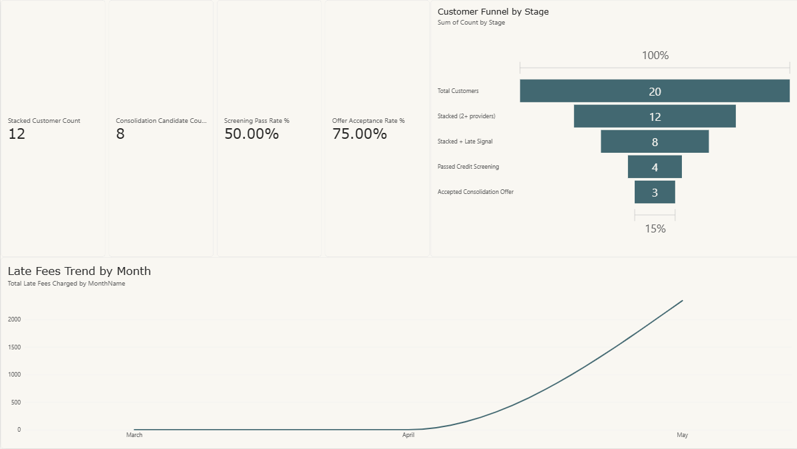
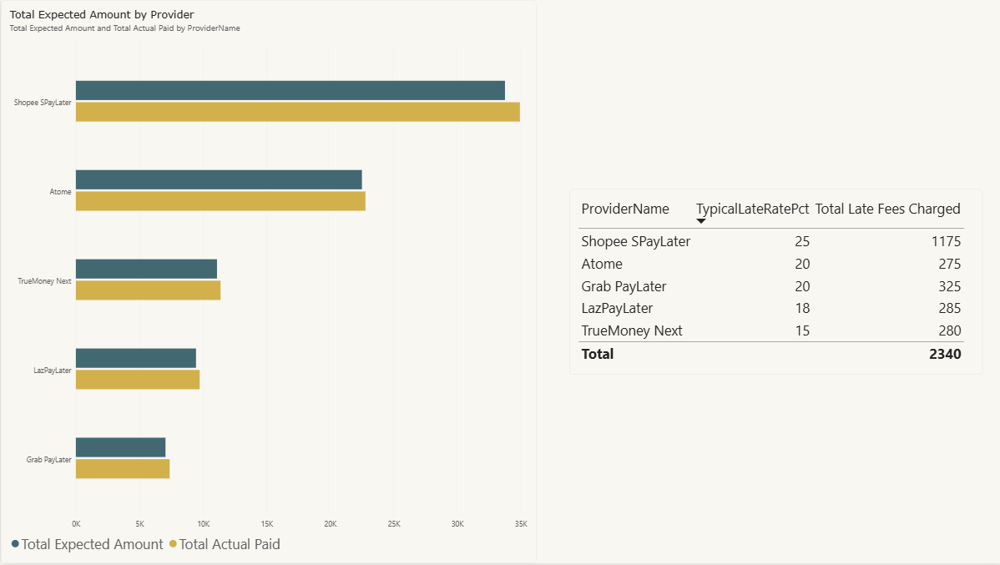
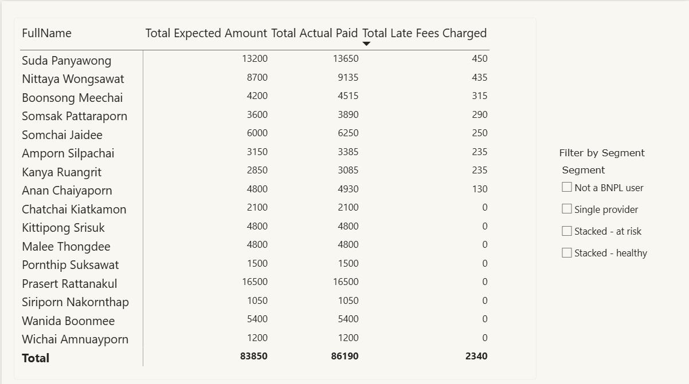
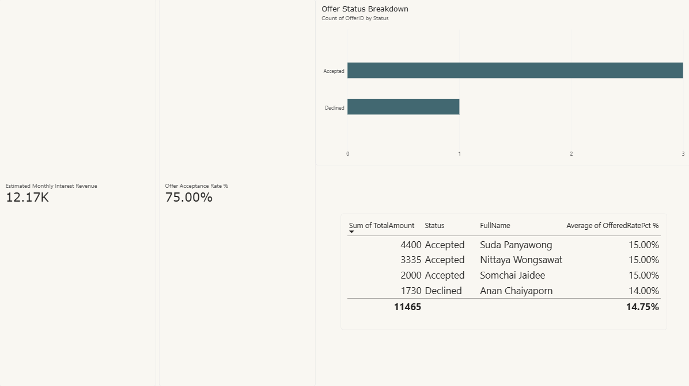

# BNPL Command Center

**A cross-provider debt-stacking detector and auto-pay hub for Thailand's Buy Now, Pay Later market — built as a full BA/DA deliverable set: BRD, FRD, SQL, Excel, and Power BI.**

---

## The problem

Thailand's BNPL market is worth roughly **THB 17.9 billion**, with **4.91 million active accounts** at the end of 2024 and growth near **100% year-over-year**. The main players — Atome, Shopee SPayLater, Lazada PayLater, and TrueMoney Next — each run their own lightweight ("soft") credit check to keep approvals fast and sales flowing.

That speed comes at a structural cost: **no provider can see what a customer owes the others.** A customer can be current with Atome, current with SPayLater, and current with TrueMoney Next, while quietly carrying three simultaneous installment plans that no single lender knows about. Only one provider (SPayLater, since May 2025) reports to Thailand's national credit bureau (NCB) at all — so this blind spot isn't a data-quality problem, it's structural.

**Why now, specifically:**
- Thailand's central bank (Bank of Thailand) is expected to introduce new BNPL regulations in **Q4 2026** — minimum age 18, an interest rate cap of 15–20%, and a credit limit of THB 20,000 *per provider* (meaning a customer can still stack roughly THB 60,000 across three providers even after the rule takes effect).
- In **April 2026, KBank's investment arm acquired a majority stake (50%+) in Atome Thailand** — a major Thai bank now directly owns a BNPL provider's loan book, and cross-provider exposure changes from a theoretical risk to KBank's own balance-sheet problem.

This project treats debt stacking as a solvable data problem: aggregate a customer's BNPL obligations across providers from their own bank transaction history, surface it in one place, and keep every 0%-interest customer current automatically — while routing genuinely struggling customers toward help instead of more debt.

## How it works

```
Bank transaction history
        │
        ▼
Match transactions to known BNPL providers (Atome, SPayLater, LazPayLater, TrueMoney Next, …)
        │
        ▼
Single dashboard: every provider, every due date, one total owed
        │
        ▼
Auto-Pay deducts and pays each provider individually, on that provider's own due date — never consolidated into one transfer (no float held on the customer's behalf)
        │
        ▼
(For customers already falling behind) optional debt consolidation loan —
   offered only after standard credit checks (credit score, income, a tiered DSR check:
   full offer at DSR ≤40%, a smaller/shorter limited offer up to DSR 60% with a higher
   credit-score bar, otherwise not eligible)
   Customers who don't qualify are referred to the Bank of Thailand's
   existing debt-relief program instead of more debt.
```

The product is designed for **embedded/white-label distribution inside a partner bank's own app** (e.g. K PLUS) — not as a standalone app competing for downloads. A customer never "discovers" it; it just appears as a new feature inside a banking app they already use daily.

## Revenue model

Modeled on **Rocket Money** (US, $1B+ valuation) but adapted for this market: the *consumer* side of the model is inspired by Rocket Money's freemium bill-tracking approach, while the actual **revenue engine here is entirely B2B** — the consumer app (dashboard *and* auto-pay) is 100% free, and revenue comes from licensing the technology to partner banks:

- **One-time setup/integration fee** + **recurring monthly license fee**, tiered by bank size
- **Tier 1** — the Big 6 Thai banks by assets (KBank, SCB, BBL, KTB, Krungsri, TTB — each >THB 1.5 trillion in assets)
- **Tier 2** — 7 mid-size domestic banks (TISCO, Kiatnakin Phatra, CIMB Thai, LH Bank, UOB Thai, Standard Chartered Thai, ICBC Thai)

**Base case:** 2 Tier-1 + 4 Tier-2 banks signed within 12 months → **THB 13.66M** Year-1 revenue (8.6M setup + 5.06M recurring).

**Sensitivity analysis** (built in Excel) tested multiple assumptions and found the single highest-leverage variable is **Tier-1 sales-cycle pace**, not price: Year-1 revenue swings from ~THB 10.08M (12-month sales cycle) to ~THB 17.24M (4-month cycle) — a 71% spread — because the entire 6-bank Tier-1 market is never fully closed within Year 1 regardless of pace. Deal-closing speed is the real constraint.

## What's in this repo

| Folder | Contents |
|---|---|
| [`01_BRD`](./01_BRD) | Business Requirements Document — charter, stakeholder matrix, requirements, user stories, risk register, As-Is → To-Be |
| [`02_FRD`](./02_FRD) | Functional Requirements Document — 14 functional requirements, 6 business rules, 6 non-functional requirements, 5 documented edge cases, and 14 annotated wireframe screens (S1–S14) |
| [`03_SQL`](./03_SQL) | PostgreSQL schema, synthetic sample data, and 16 practice queries — including window functions and a correlated subquery to detect cross-provider debt stacking within a trailing 90-day window |
| [`04_Excel`](./04_Excel) | Analysis workbook: customer lookup (INDEX/MATCH and XLOOKUP), data-quality QA checks, pivot tables, and the B2B revenue model with sensitivity analysis; plus a bonus Excel formula cheat sheet |
| [`05_PowerBI`](./05_PowerBI) | Power BI dashboard (`.pbix`) — a 5-table star schema, 9 DAX measures, and a 4-page report (Executive Overview, Provider Analysis, Customer Segment Drilldown, Revenue & Offers). Screenshots of all 4 pages are below, since a `.pbix` can't be opened without Power BI Desktop installed. Also included: a step-by-step [build guide](./05_PowerBI/BNPL_Command_Center_PowerBI_Guide.docx) documenting the full data-model and DAX build process — a documentation/knowledge-transfer sample. |
| [`06_UAT_Test_Cases`](./06_UAT_Test_Cases) | 17 user acceptance test cases covering the core detection, auto-pay, and consolidation-offer flows |

## Power BI Dashboard

Screenshots of all 4 report pages — the `.pbix` itself (in [`05_PowerBI`](./05_PowerBI)) needs Power BI Desktop installed to open.

**Executive Overview**

Live KPI cards (Stacked Customer Count, Consolidation Candidate Count, Screening Pass Rate %, Offer Acceptance Rate %) next to a funnel from 20 total customers down to 3 accepted consolidation offers, and a late-fees trend climbing March → May as more customers stack providers.

**Provider Analysis**

Expected vs. actual paid amount by provider, next to each provider's typical late rate and total late fees charged — Shopee SPayLater carries both the highest penalty rate (25%) and by far the highest late fees (THB 1,175) in the sample.

**Customer Segment Drilldown**

Customer-level detail with a Segment slicer (Not a BNPL user / Single provider / Stacked – healthy / Stacked – at risk). This is the page the "Key finding" below is drawn from — every baht of the THB 2,340 in sample late fees traces back to customers stacked across 2+ providers.

**Revenue & Offers**

Consolidation-offer economics: estimated monthly interest revenue (THB 12.17K), offer acceptance rate (75%), and individual offers broken out by status and rate.

## Key finding

Cross-checked independently across two deliverables: in the sample data, **100% of late fees charged (THB 2,340) occurred among customers stacked across 2+ BNPL providers — none occurred among single-provider customers** — visible both in the Power BI Customer Segment Drilldown page and in the Excel workbook's Pivot3. This is the core evidence for why cross-provider visibility (not just single-provider risk scoring) is the actual gap worth closing.

*Methodology note:* within the stacked population, "Stacked – at risk" vs. "Stacked – healthy" is a rule-based label (a customer is tagged "at risk" precisely because a late-payment signal already exists for them) — not an independent finding, so it isn't cited as separate evidence here. The stacked-vs-single-provider split above is the part of the result that wasn't built into its own definition.

## Honest limitations

- All data is **synthetic**, built to reflect real-world proportions (e.g. a US CFPB study found 63% of BNPL users carry more than one concurrent loan) rather than real Thai transaction data.
- Bank-partner pricing (setup fee, license fee) is an **assumption**, disclosed as such in the workbook — no public Thai B2B-fintech pricing benchmark exists to cite.
- Bank of Thailand's BNPL rules are **not yet finalized** (expected Q4 2026); the model is built with adjustable parameters rather than hard-coded figures.
- Transaction-to-provider name matching would need testing against real bank data to establish real-world accuracy — this project assumes clean matches.

## About this project

Built as a BA/DA portfolio project for job applications in Thailand's banking sector, given the timing of the Bank of Thailand's upcoming BNPL regulation and KBank's April 2026 acquisition of a majority stake in Atome Thailand.

